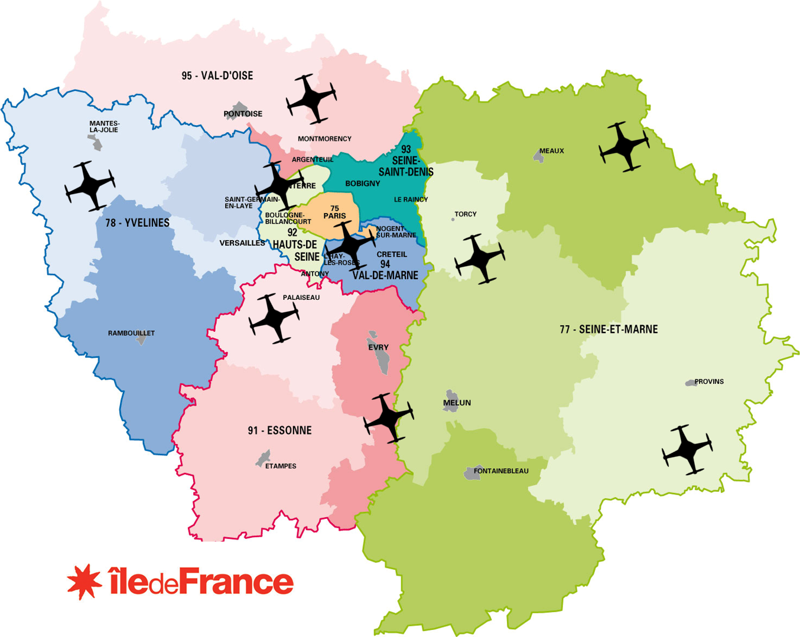
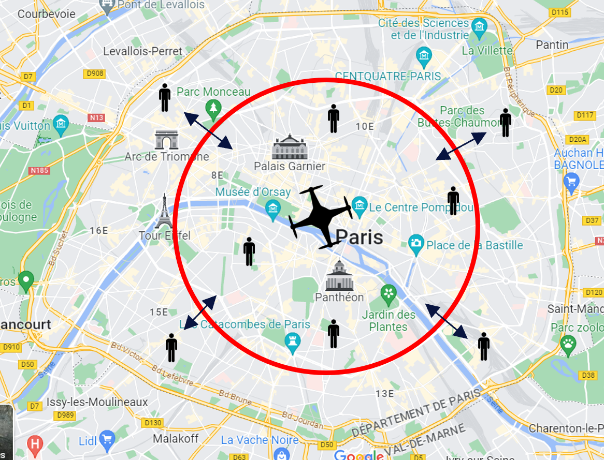

# Peace-Keeper

The project consist to develop a real-time solution to monitoring civilians in order to prevent any acts of rebelion.  
The project is fully-developped in scala and spark is used for the statistics part (dataframe) and architecture part for the stream kafka for example.  
Master 1 project made for the Data Engineering cursus at Efrei Paris.  
Made with Sivananthan Sarankan and Sebastiao-Esteves Kevin.  

The architecture have 4 components :
1. a program simulating the drone and sending drone-like data to the solution. This program is not distributed (no spark). The system store message in a distributed stream making it available to the component 2 and 3.  
2. handle riot alert message from stream.  
3. store message formatted as drone message in a distributed storage.  
4. analyse stored data with a distributed processing component (like spark). As a proof of the system capacity to analyse the store data answer 4 questions of our choices. (ex: is there more riot during the week or during week-end?).

All components run independently, they are scalable and used in a scalable way.

